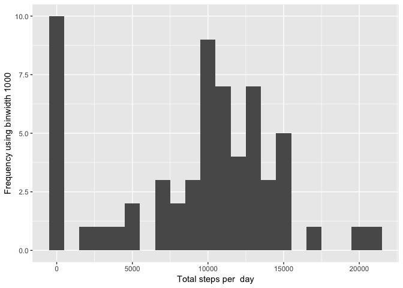
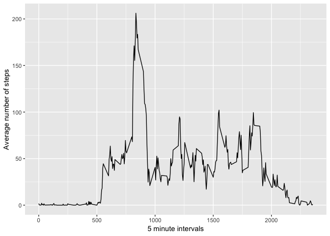
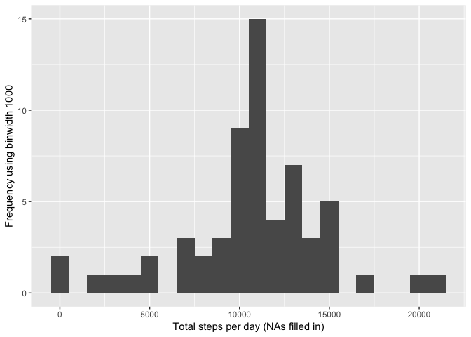
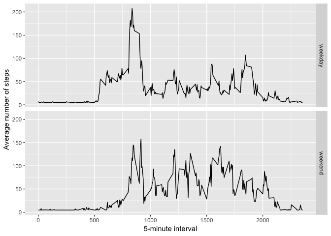

## Loading and preprocessing the data


```r
# setting working directory
dir = '/Users/aline/Desktop'
setwd(dir)

# loading data
df <- read.csv('activity.csv', header = T, sep=',')

#
df$date <- as.Date(df$date)
```


## What is mean total number of steps taken per day?

```r
# make a summary table for the plot
sum.table <- tapply(df$steps, df$date, sum, na.rm =T)


# load ggplot
library(ggplot2)

# plot steps per day
qplot(sum.table, xlab = 'Total steps per  day', ylab= 'Frequency using binwidth 1000', binwidth = 1000)
```

<!-- -->


```r
#print mean
meansteps <- mean(sum.table)

#print median
mediansteps <- median(sum.table)
```

* Mean: 9354.2295082   
* Median: 10395  


## What is the average daily activity pattern?


```r
# summary dataframe
averageStepsPerBlock <- aggregate(x=list(meansteps=df$steps), by=list(interval=df$interval), FUN= mean,na.rm= T)
```

Make plot for average number of steps per 5-minute interval

```r
# make plot
ggplot(averageStepsPerBlock, aes(x=interval, y=meansteps)) + geom_line() + xlab('5 minute intervals')+ ylab('Average number of steps')
```

<!-- -->
Let's evaluate which interval across all days cotains the maximum number of steps.


```r
maxsteps <- which.max(averageStepsPerBlock$meansteps)
intervalmaxsteps <- gsub("([0-9]{1,2})([0-9]{2})","\\1:\\2", averageStepsPerBlock[maxsteps,'interval'])
```

* Most steps as: 8:35

## Imputing missing values
Calculate and report the total number of NA's

```r
nas <- length(which(is.na(df$steps)))
```

* Number of NA's: 2304


```r
# load mice library
library(Hmisc)
```

```
## Warning: package 'Hmisc' was built under R version 3.5.2
```

```r
# make dataset where na's filled in
dfna <- df
#fill in mean steps where na
dfna$steps <- impute(df$steps, fun=mean)
```

Plot total number of steps taken each day

```r
stepsbydaynona<- tapply(dfna$steps, dfna$date, sum)
qplot(stepsbydaynona, xlab='Total steps per day (NAs filled in)', ylab='Frequency using binwidth 1000', binwidth=1000)
```

<!-- -->
Print mean and median number of steps taken per day.

```r
meanna <- mean(stepsbydaynona)
medianna <- median(stepsbydaynona)
```

* Mean (NA's filled in): 1.0766189\times 10^{4}
* Median (NA's filled in): 1.0766189\times 10^{4}  


## Are there differences in activity patterns between weekdays and weekends?

```r
# make a new factorial variable indicating weekdays and weekends
dfna$days <-  ifelse(as.POSIXlt(dfna$date)$wday %in% c(0,6), 'weekend', 'weekday')
dfna$days <- as.factor(dfna$days)

# make panel plot, 1. get summary data, then plot
meandfna <- aggregate(steps ~ interval + days, data=dfna, mean)
ggplot(meandfna, aes(interval, steps)) + 
    geom_line() + 
    facet_grid(days ~ .) +
    xlab("5-minute interval") + 
    ylab("Average number of steps")
```

<!-- -->
